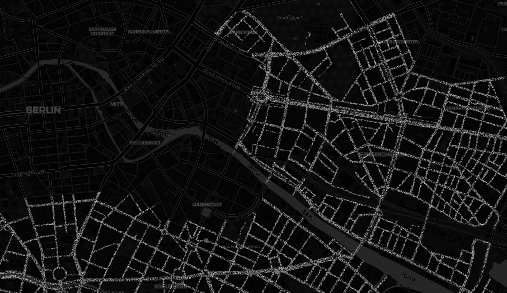
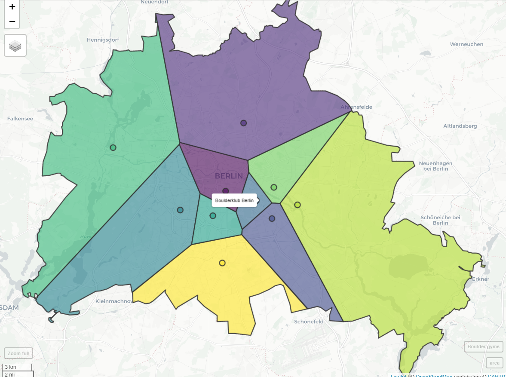
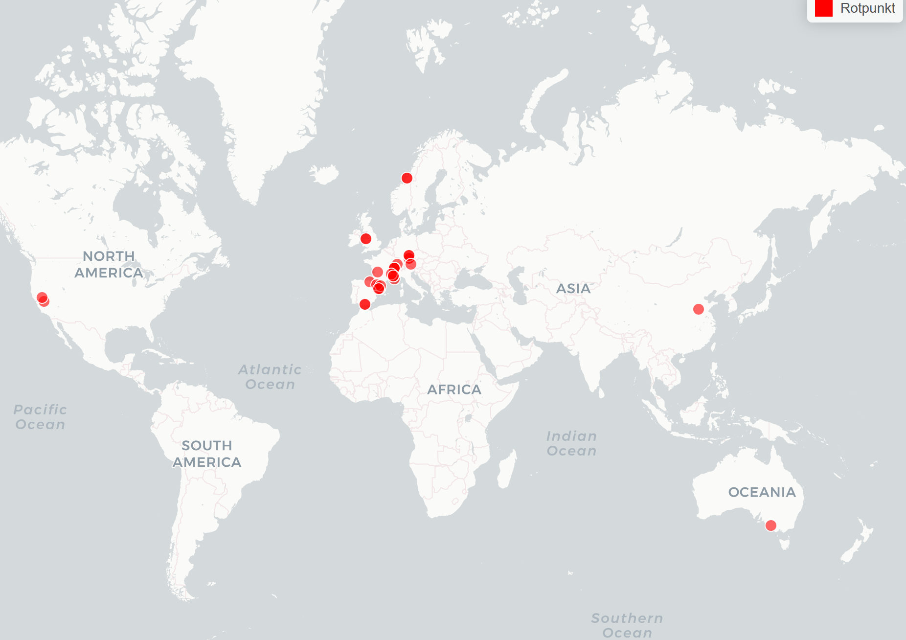

# 30daymapchallenge

https://alexandrakapp.github.io/30daymapchallenge/

What is the [30dayMapChallenge](https://github.com/tjukanovt/30DayMapChallenge)?

**My results**

The idea is to make 30 maps from each day from 1st Nov to 30th Nov 2020. I hope to get about half done - so 15 maps.

I want to use this challenge to play around with different R packages for geospatial data and try out different ways of interactive visualizations.

## Day 1: Points

**Amount of cars in XHain mapped as points onto streets**

There are 80.808 cars registered in Friedrichshain-Kreuzberg (2017). 

If all cars would start driving at the same time - it'd get pretty crowded

[Click here for full map](https://alexandrakapp.github.io/30daymapchallenge/html/day1.html)

The polygon of the streets are derived as a 'negative' from the official blocks provided by the Geoportal Berlin. Points to represent cars are sampled randomly within the polygon.

[R source code](https://github.com/AlexandraKapp/30daymapchallenge/blob/main/R/day1.R)

**Data:**

- [Amount of cars via kleine Anfragen](https://s3.kleine-anfragen.de/ka-prod/be/18/20848.pdf)
- [Polygon of streets derived from Geoportal Berlin 'Blockkarte 1:5000 (ISU5)'](https://fbinter.stadt-berlin.de/fb/index.jsp?loginkey=zoomStart&mapId=ISU5@senstadt&bbox=387452,5818178,395140,5822472)

**Tools & Packages:**

- [*sf*](https://r-spatial.github.io/sf/) and [*mapdeck*](https://github.com/SymbolixAU/mapdeck) R package

## Day 2: Lines

**All domestic German flights 2019**

About [10% of all flights](https://www.dfs.de/dfs_homepage/en/Press/Publications/Mobility_Report_2017.pdf) from German airports are domestic flights - so starting in Germany and landing in Germany.

The amount of flights between German airports are mapped here:

[Click here for full map](https://alexandrakapp.github.io/30daymapchallenge/html/day2.html)

[R source code](https://github.com/AlexandraKapp/30daymapchallenge/blob/main/R/day2.R)

**Data:**

- [Eurostat, the Statistical Office of the European Union, Air passenger transport between the main airports of Germany](https://appsso.eurostat.ec.europa.eu/nui/show.do?dataset=avia_par_de&lang=en)

**Tools & Packages:**

- geocode airports: [*tmaptools R package*](https://github.com/mtennekes/tmaptools)
- viz: [*flowmap.blue R package*](https://github.com/FlowmapBlue/flowmapblue.R)

## Day 3: Polygons

**The catchment area of boulder gyms in Berlin**

Playing around with Voroni maps: 
"Voronoi polygons are created so that every location within a polygon is closer to the sample point in that polygon than any other sample point."

Here: All boulder gyms (that I know of) in Berlin. If everyone would go his or her closest gym (by beeline), this would be the catchment areas of each boulder gym.

[Click here for full map](https://alexandrakapp.github.io/30daymapchallenge/html/day3.html)

[R source code](https://github.com/AlexandraKapp/30daymapchallenge/blob/main/R/day3.R)

**Tools & Packages:**

- geocode boulder gyms: [*tmaptools R package*](https://github.com/mtennekes/tmaptools)
- viz: [*mapview*](https://github.com/r-spatial/mapview)

## Day 4: Hexagons

**Traffic accidents in Stuttgart**

The 'Statistikportal' offers a great data set on (almost) all accidents in Germany as single points. The `mapdeck` package auto aggregates point data into hexagons - so no need for data pre-processing.

I chose to crop the data to the outline of Stuttgart - but any other region or city can easily be used with the code by setting a different outline.

[Click here for full map](https://alexandrakapp.github.io/30daymapchallenge/html/day4.html)

[R source code](https://github.com/AlexandraKapp/30daymapchallenge/blob/main/R/day4.R)

**Data:**

- [Unfallatlas | Statistische Ämter des Bundes und der Länder](https://unfallatlas.statistikportal.de/_opendata2020.html)

**Tools & Packages:**

- get outline of Stuttgart: [*osmdata*](https://cran.r-project.org/web/packages/osmdata/vignettes/osmdata.html)
- viz: [*mapview R package*](https://github.com/r-spatial/mapview)

## Day 5: Blue
## Day 6: Red

**Rotpunkt**

Today is another one on climbing - it's less about the mapping tools.

In sport climbing, redpointing is free-climbing a route, while lead climbing, after having practiced the route beforehand.
The English term "redpoint" is a loan translation of the German Rotpunkt coined by Kurt Albert in the mid-1970s at Frankenjura. He would paint a red X on a fixed pin so that he could avoid using it for a foot- or handhold. Once he was able to free-climb the entire route, he would put a red dot at the base of the route. In many ways, this was the origin of the free climbing movement that led to the development of sport climbing ten years later. [Wikipedia](https://en.wikipedia.org/wiki/Redpoint_(climbing))

This map shows all notable ascents according to [Wikipedia](https://en.wikipedia.org/wiki/Redpoint_(climbing)).

[Click here for full map](https://alexandrakapp.github.io/30daymapchallenge/html/day6.html)

[R source code](https://github.com/AlexandraKapp/30daymapchallenge/blob/main/R/day6.R)

**Data:**

Self compiled [data set](https://github.com/AlexandraKapp/30daymapchallenge/blob/main/data/rotpunkt.csv) using:

- [Wikipedia](https://en.wikipedia.org/wiki/Redpoint_(climbing))
- Coordinates mostly collected from [thecrag.com](https://www.thecrag.com/)

## Day 7: Green
## Day 8: Yellow

**Hours of sunshine in Germany 2019**

Where in Germany was a lot of sunshine in 2019 - where was it rather grey?

[Click here for full map](https://alexandrakapp.github.io/30daymapchallenge/html/day8.html)

[R source code](https://github.com/AlexandraKapp/30daymapchallenge/blob/main/R/day8.R)

**Data:**

- [DWD Climate Data Center (CDC), Jahressumme der Raster der monatlichen Sonnenscheindauer für Deutschland, Version v1.1.](https://opendata.dwd.de/climate_environment/CDC/grids_germany/annual/sunshine_duration/)

**Tools & Packages:**

- reading ESRI ascii grid file format: [*sp R package*](https://github.com/edzer/sp)
- viz of raster data: [*leaflet R package*](https://rstudio.github.io/leaflet/)
- hover information for raster data: [*leafem R package*](https://github.com/r-spatial/leafem)

## Day 9: Monochrome
## Day 10: Grid
## Day 11: 3D
## Day 12: Map not made with GIS software
## Day 13: Raster
## Day 14: Climate change
## Day 15: Connections
## Day 16: Island(s)
## Day 17: Historical map
## Day 18: Landuse
## Day 19: NULL
## Day 20: Population
## Day 21: Water
## Day 22: Movement
## Day 23: Boundaries
## Day 24: Elevation
## Day 25: COVID-19
## Day 26: Map with a new tool
## Day 27: Big or small data
## Day 28: Non-geographic map
## Day 29: Globe
## Day 30: A map
