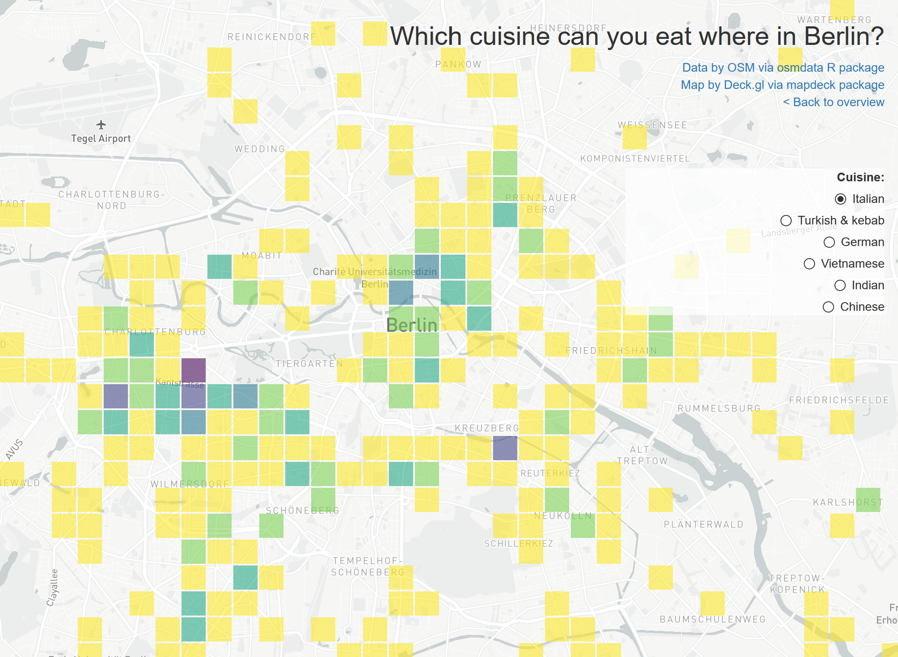

# 30daymapchallenge

https://alexandrakapp.github.io/30daymapchallenge/

What is the [30dayMapChallenge](https://github.com/tjukanovt/30DayMapChallenge)?

**My results**

The idea is to make 30 maps from each day from 1st Nov to 30th Nov 2020. I hope to get about half done - so 15 maps.

I want to use this challenge to play around with different R packages for geospatial data and try out different ways of interactive visualizations.

## Day 1: Points

**Amount of cars in XHain mapped as points onto streets**

There are 80.808 cars registered in Friedrichshain-Kreuzberg (2017). 

If all cars would start driving at the same time - it'd get pretty crowded

[Click here for full map](https://alexandrakapp.github.io/30daymapchallenge/html/day1.html)

The polygon of the streets are derived as a 'negative' from the official blocks provided by the Geoportal Berlin. Points to represent cars are sampled randomly within the polygon.

[R source code](https://github.com/AlexandraKapp/30daymapchallenge/blob/main/R/day1.R)

**Data:**

- [Amount of cars via kleine Anfragen](https://s3.kleine-anfragen.de/ka-prod/be/18/20848.pdf)
- [Polygon of streets derived from Geoportal Berlin 'Blockkarte 1:5000 (ISU5)'](https://fbinter.stadt-berlin.de/fb/index.jsp?loginkey=zoomStart&mapId=ISU5@senstadt&bbox=387452,5818178,395140,5822472)

**Tools & Packages:**

- [*sf*](https://r-spatial.github.io/sf/) and [*mapdeck*](https://github.com/SymbolixAU/mapdeck) R package

## Day 2: Lines

**All domestic German flights 2019**

About [10% of all flights](https://www.dfs.de/dfs_homepage/en/Press/Publications/Mobility_Report_2017.pdf) from German airports are domestic flights - so starting in Germany and landing in Germany.

The amount of flights between German airports are mapped here:

[Click here for full map](https://alexandrakapp.github.io/30daymapchallenge/html/day2.html)

[R source code](https://github.com/AlexandraKapp/30daymapchallenge/blob/main/R/day2.R)

**Data:**

- [Eurostat, the Statistical Office of the European Union, Air passenger transport between the main airports of Germany](https://appsso.eurostat.ec.europa.eu/nui/show.do?dataset=avia_par_de&lang=en)

**Tools & Packages:**

- geocode airports: [*tmaptools R package*](https://github.com/mtennekes/tmaptools)
- viz: [*flowmap.blue R package*](https://github.com/FlowmapBlue/flowmapblue.R)

## Day 3: Polygons

**The catchment area of boulder gyms in Berlin**

Playing around with Voroni maps: 
"Voronoi polygons are created so that every location within a polygon is closer to the sample point in that polygon than any other sample point."

Here: All boulder gyms (that I know of) in Berlin. If everyone would go his or her closest gym (by beeline), this would be the catchment areas of each boulder gym.

[Click here for full map](https://alexandrakapp.github.io/30daymapchallenge/html/day3.html)

[R source code](https://github.com/AlexandraKapp/30daymapchallenge/blob/main/R/day3.R)

**Tools & Packages:**

- geocode boulder gyms: [*tmaptools R package*](https://github.com/mtennekes/tmaptools)
- viz: [*mapview*](https://github.com/r-spatial/mapview)

## Day 4: Hexagons

**Traffic accidents in Stuttgart**

The 'Statistikportal' offers a great data set on (almost) all accidents in Germany as single points. The `mapdeck` package auto aggregates point data into hexagons - so no need for data pre-processing.

I chose to crop the data to the outline of Stuttgart - but any other region or city can easily be used with the code by setting a different outline.

[Click here for full map](https://alexandrakapp.github.io/30daymapchallenge/html/day4.html)

[R source code](https://github.com/AlexandraKapp/30daymapchallenge/blob/main/R/day4.R)

**Data:**

- [Unfallatlas | Statistische Ämter des Bundes und der Länder](https://unfallatlas.statistikportal.de/_opendata2020.html)

**Tools & Packages:**

- get outline of Stuttgart: [*osmdata*](https://cran.r-project.org/web/packages/osmdata/vignettes/osmdata.html)
- viz: [*mapview R package*](https://github.com/r-spatial/mapview)

## Day 5: Blue
## Day 6: Red

**Rotpunkt**

Today is another one on climbing - it's less about the mapping tools.

In sport climbing, redpointing is free-climbing a route, while lead climbing, after having practiced the route beforehand.
The English term "redpoint" is a loan translation of the German Rotpunkt coined by Kurt Albert in the mid-1970s at Frankenjura. He would paint a red X on a fixed pin so that he could avoid using it for a foot- or handhold. Once he was able to free-climb the entire route, he would put a red dot at the base of the route. In many ways, this was the origin of the free climbing movement that led to the development of sport climbing ten years later. [Wikipedia](https://en.wikipedia.org/wiki/Redpoint_(climbing))

This map shows all notable ascents according to [Wikipedia](https://en.wikipedia.org/wiki/Redpoint_(climbing)).

[Click here for full map](https://alexandrakapp.github.io/30daymapchallenge/html/day6.html)

[R source code](https://github.com/AlexandraKapp/30daymapchallenge/blob/main/R/day6.R)

**Data:**

Self compiled [data set](https://github.com/AlexandraKapp/30daymapchallenge/blob/main/data/rotpunkt.csv) using:

- [Wikipedia](https://en.wikipedia.org/wiki/Redpoint_(climbing))
- Coordinates mostly collected from [thecrag.com](https://www.thecrag.com/)

## Day 7: Green
## Day 8: Yellow

**Hours of sunshine in Germany 2019**

Where in Germany was a lot of sunshine in 2019 - where was it rather grey?

[Click here for full map](https://alexandrakapp.github.io/30daymapchallenge/html/day8.html)

[R source code](https://github.com/AlexandraKapp/30daymapchallenge/blob/main/R/day8.R)

**Data:**

- [DWD Climate Data Center (CDC), Jahressumme der Raster der monatlichen Sonnenscheindauer für Deutschland, Version v1.1.](https://opendata.dwd.de/climate_environment/CDC/grids_germany/annual/sunshine_duration/)

**Tools & Packages:**

- reading ESRI ascii grid file format: [*sp R package*](https://github.com/edzer/sp)
- viz of raster data: [*leaflet R package*](https://rstudio.github.io/leaflet/)
- hover information for raster data: [*leafem R package*](https://github.com/r-spatial/leafem)

## Day 9: Monochrome

**The life lines of Berlin**

A fast way to find major streets within a city, without searching for any data on traffic amounts, street types or street width:

Take random start and end points within the city and run a routing to find routes connecting the start and end points. 

Then aggregate the single street segments on how often they were used.
You then get an image of the major city axes.

Big thanks to the *stplanr* package, which makes this easily done within a few lines of code!

[Click here for full map](https://alexandrakapp.github.io/30daymapchallenge/html/day9.html)

[R source code](https://github.com/AlexandraKapp/30daymapchallenge/blob/main/R/day9.R)

**Tools & Packages:**

- routing and aggregating line segments: [*stplanr R package*](https://github.com/ropensci/stplanr)
- viz: [*leaflet R package*](https://rstudio.github.io/leaflet/)

## Day 10: Grid

**Which cuisine can you eat where in Berlin?**

[Click here for full map](https://lxndrkp.shinyapps.io/day10/)

[R source code](https://github.com/AlexandraKapp/30daymapchallenge/blob/main/R/day10.R)

**Tools & Packages:**

- Data on restaurants: [*osmdata R package*](https://github.com/ropensci/osmdata)
- Viz: [*mapdeck R package*](https://github.com/SymbolixAU/mapdeck)

**Data:**

OpenStreetMap via osmdata package

## Day 11: 3D

**Mapping the alpes in 3D**

Playing around with the *mapdeck::add_terrain()* function. Not perfect yet, but works for a first try.

[Click here for full map](https://alexandrakapp.github.io/30daymapchallenge/html/day11.html)

[R source code](https://github.com/AlexandraKapp/30daymapchallenge/blob/main/R/day11.R)

**Data:**

Elevation data with [Mapbox](https://www.mapbox.com/) Tiles:

- [elevation](https://api.mapbox.com/v4/mapbox.terrain-rgb/5/16/11@2x.pngraw?access_token=pk.eyJ1IjoibHhuZHJrcHAiLCJhIjoiY2p1NWl6OGZsMTU3dDQ0bnI1YnV6YjBkNiJ9.ySV4AyiDcNZmzd9ASRyvRw)
- [texture](https://api.mapbox.com/v4/mapbox.satellite/5/16/11@2x.jpg90?access_token=pk.eyJ1IjoibHhuZHJrcHAiLCJhIjoiY2p1NWl6OGZsMTU3dDQ0bnI1YnV6YjBkNiJ9.ySV4AyiDcNZmzd9ASRyvRw)

**Tools & Packages:**

- Viz: [*mapdeck R package*](https://github.com/SymbolixAU/mapdeck)

## Day 12: Map not made with GIS software

## Day 13: Raster

**Noise in Berlin**

OpenGIS Web Services (OWS) define geospatial standards to provide geo data, like WFS (Web Feature Service) for vector data and WMS (Web Map Service) for raster data. 
Yet, these standards are not widely known with developers or data analysts who are used to working with ESRI-shape files, geojsons, etc.

Some spatial data infrastructure providers, as the Geodatenportal Berlin (FIS-Broker) only offer these services and no further file download.

There are some resources on how to use those services in R, e.g. [here some general info](https://geocompr.robinlovelace.net/read-write.html#geographic-web-services) and [here more specific for the Berlin FIS-Broker](https://github.com/patperu/fisbroker_data).

Though, all example code was on retrieving vector data of WFS services. For todays challenge "raster" I wanted to try out, how easy it is to get raster data (WMS) straight into R.

It's not entirely straight forward, as you need to find some parameters (e.g. "layers") through the *getCapabilities* query first. Then you retrieve a PNG where you need to set a proper georeference again, with a bounding box and CRS. 
Therefore, I still find the easiest way for a one time download to use QGIS ([I wrote a blog post on how to do that at the Technologiestiftung Berlin](https://lab.technologiestiftung-berlin.de/projects/fisbroker-to-qgis/de/)), as QGIS does all this setting the correct parameters already for you.

[Click here for full map](https://alexandrakapp.github.io/30daymapchallenge/html/day13.html)

[R source code](https://github.com/AlexandraKapp/30daymapchallenge/blob/main/R/day13.R)

**Data:**

[Geodatenportal Berlin: Strat. Lärmkarte Gesamtlärmindex L_DEN (Tag-Abend-Nacht) Raster 2017 (Umweltatlas)](https://fbinter.stadt-berlin.de/fb/index.jsp?loginkey=zoomStart&mapId=wmsk_07_05_14verkehr_gesDEN2016@senstadt&bbox=13,52,13,52')

**Tools & Packages:**

- construct URL *httr R package*
- plot RGB raster layer  [*leafem R package*](https://github.com/r-spatial/leafem)

## Day 14: Climate change

**Area of destroyed rain forest in 2019**

In 2019 121.500 square km of rain forest had been destroyed. But how much is that?
This map shows a polygon as large as the destroyed area that can be moved to any spot on the map to compare it to. 

[Click here for full map](https://alexandrakapp.github.io/30daymapchallenge/html/day14.html)

[R source code](https://github.com/AlexandraKapp/30daymapchallenge/blob/main/R/day14.R)

**Data:**

- [Amount of destroyed rainforest](https://www.faszination-regenwald.de/info-center/zerstoerung/flaechenverluste/)

**Tools & Packages:**

- viz of raster data: [*leaflet R package*](https://rstudio.github.io/leaflet/)
- map editing and drawing for leaflet: [*leafpm R package*](https://github.com/r-spatial/leafpm)

## Day 15: Connections
## Day 16: Island(s)
## Day 17: Historical map
## Day 18: Landuse
## Day 19: NULL
## Day 20: Population

**Movement within Berlin ("Binnenwanderung")**

Many people are moving to Berlin from other places - especially the center - "im Ring" - is popular for people comiing to the city. 
But once in Berlin - how do people move between the different districts ("Binnenwanderung")? More people move from the center districts to the outskirts. (Data from 2013)

Click on a district to see where the people are coming from that move to this district.

Click events on leaflet maps are possible with shiny observe events.

[Click here for full map](https://lxndrkp.shinyapps.io/day20/)

[R source code](https://github.com/AlexandraKapp/30daymapchallenge/blob/main/R/day20.R)

**Data:**

- [Amt für Statistik Berlin-Brandenburg: Binnenwanderungen sind die Zu- und Fortzüge innerhalb der Regionaleinheiten einer Region (2013)](https://www.statistik-berlin-brandenburg.de/webapi/opendatabase?id=WBBEb13)

**Tools & Packages:**

- viz and clicking interaction: [*leaflet R package*](https://rstudio.github.io/leaflet/) & [*shiny R package*](https://shiny.rstudio.com/)

## Day 21: Water
## Day 22: Movement

**U-Bahn trains moving through Berlin**

All U-Bahn trains moving through the city on a regular Monday using the *{mapdeck::add_trips()}* function.

[Click here for full map](https://alexandrakapp.github.io/30daymapchallenge/html/day22.html)

[R source code](https://github.com/AlexandraKapp/30daymapchallenge/blob/main/R/day22.R)

**Data:**

- [VBB GTFS Feed](https://www.vbb.de/unsere-themen/vbbdigital/api-entwicklerinfos/datensaetze)

**Tools & Packages:**

- Viz: [*mapdeck R package*](https://github.com/SymbolixAU/mapdeck)
- read GTFS data:  [*tidytransit R package*](https://github.com/r-transit/tidytransit)

## Day 23: Boundaries
## Day 24: Elevation
## Day 25: COVID-19
## Day 26: Map with a new tool

**Flight departures by Airport in Germany**

Today is not made with R, but with [Datawrapper](https://www.datawrapper.de/)

[Click here for full map](https://datawrapper.dwcdn.net/y6N58/1/)

[R source code](https://github.com/AlexandraKapp/30daymapchallenge/blob/main/R/day26.R)

**Data:**

- [Eurostat, the Statistical Office of the European Union, Air passenger transport between the main airports of Germany](https://appsso.eurostat.ec.europa.eu/nui/show.do?dataset=avia_par_de&lang=en)

**Tools & Packages:**
[Datawrapper](https://www.datawrapper.de/)

## Day 27: Big or small data
## Day 28: Non-geographic map
## Day 29: Globe
## Day 30: A map
