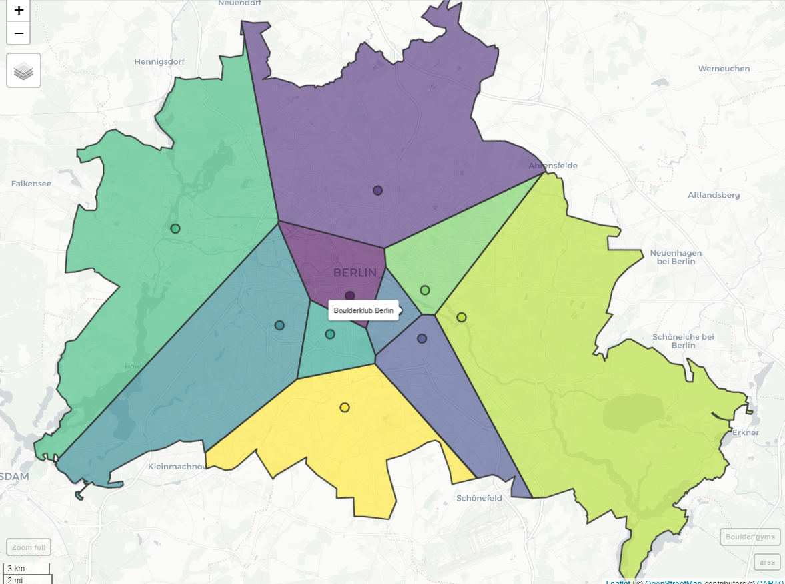

```{r setup, include=FALSE}
knitr::opts_chunk$set(echo = TRUE)
```

<style>
.center {
  display: block;
  margin-left: auto;
  margin-right: auto;
  width: 100%;
}
</style>

## #30dayMapChallenge 
What is the [30dayMapChallenge](https://github.com/tjukanovt/30DayMapChallenge)?

**My results `r emo::ji("tada")`**

The idea is to make 30 maps from each day from 1st Nov to 30th Nov 2020. I hope to get about half done - so 15 maps.

I want to use this challenge to play around with different R packages for geospatial data and try out different ways of interactive visualizations.

## Day 1: Points

**Amount of cars in XHain mapped as points onto streets**

There are 80.808 cars registered in Berlin (2017). 

If all cars would start driving at the same time - it'd get pretty crowded `r emo::ji("car")``r emo::ji("car")` `r emo::ji("car")`

<a href= html/day1.html></a>

[Click here for full map](html/day1.html)

The polygon of the streets are derived as a 'negative' from the official blocks provided by the Geoportal Berlin. Points to represent cars are sampled randomly within the polygon.

[R source code](https://github.com/AlexandraKapp/30daymapchallenge/blob/main/R/day1.R)

**Data:**

- [Amount of cars via kleine Anfragen](https://s3.kleine-anfragen.de/ka-prod/be/18/20848.pdf)
- [Polygon of streets derived from Geoportal Berlin 'Blockkarte 1:5000 (ISU5)'](https://fbinter.stadt-berlin.de/fb/index.jsp?loginkey=zoomStart&mapId=ISU5@senstadt&bbox=387452,5818178,395140,5822472)

**Tools & Packages:**

- [*sf*](https://r-spatial.github.io/sf/) and [*mapdeck*](https://github.com/SymbolixAU/mapdeck) R package

## Day 2: Lines

**All domestic German flights 2019**

About [10% of all flights](https://www.dfs.de/dfs_homepage/en/Press/Publications/Mobility_Report_2017.pdf) from German airports are domestic flights - so starting in Germany and landing in Germany.

The amount of flights between German airports are mapped here:

<a href= html/day2.html></a>

[Click here for full map](html/day2.html)

[R source code](https://github.com/AlexandraKapp/30daymapchallenge/blob/main/R/day2.R)

**Data:**

- [Eurostat, the Statistical Office of the European Union, Air passenger transport between the main airports of Germany](https://appsso.eurostat.ec.europa.eu/nui/show.do?dataset=avia_par_de&lang=en)

**Tools & Packages:**

- geocode airports: [*tmaptools R package*](https://github.com/mtennekes/tmaptools)
- viz: [*flowmap.blue R package*](https://github.com/FlowmapBlue/flowmapblue.R)


## Day 3: Polygons

**The catchment area of boulder gyms in Berlin**

Playing around with Voroni maps: 
"Voronoi polygons are created so that every location within a polygon is closer to the sample point in that polygon than any other sample point."

Here: All boulder gyms (that I know of) in Berlin. If everyone would go his or her closest gym (by beeline), this would be the catchment areas of each boulder gym.

<a href= html/day3.html></a>

[Click here for full map](html/day3.html)

[R source code](https://github.com/AlexandraKapp/30daymapchallenge/blob/main/R/day3.R)


**Tools & Packages:**

- geocode boulder gyms: [*tmaptools R package*](https://github.com/mtennekes/tmaptools)
- viz: [*mapview R package*](https://github.com/r-spatial/mapview)

## Day 4: Hexagons

**Traffic accidents in Stuttgart**

The 'Statistikportal' offers a great data set on (almost) all accidents in Germany as single points. The `mapdeck` package auto aggregates point data into hexagons - so no need for data pre-processing.

I chose to crop the data to the outline of Stuttgart - but any other region or city can easily be used with the code by setting a different outline.

<a href= html/day4.html></a>

[Click here for full map](html/day4.html)

[R source code](https://github.com/AlexandraKapp/30daymapchallenge/blob/main/R/day4.R)

**Data:**

- [Unfallatlas | Statistische Ämter des Bundes und der Länder](https://unfallatlas.statistikportal.de/_opendata2020.html)

**Tools & Packages:**

- get outline of Stuttgart: [*osmdata R package*](https://cran.r-project.org/web/packages/osmdata/vignettes/osmdata.html)
- viz: [*mapview R package*](https://github.com/r-spatial/mapview)

## Day 5: Blue
## Day 6: Red
## Day 7: Green
## Day 8: Yellow
## Day 9: Monochrome
## Day 10: Grid
## Day 11: 3D
## Day 12: Map not made with GIS software
## Day 13: Raster
## Day 14: Climate change
## Day 15: Connections
## Day 16: Island(s)
## Day 17: Historical map
## Day 18: Landuse
## Day 19: NULL
## Day 20: Population
## Day 21: Water
## Day 22: Movement
## Day 23: Boundaries
## Day 24: Elevation
## Day 25: COVID-19
## Day 26: Map with a new tool
## Day 27: Big or small data
## Day 28: Non-geographic map
## Day 29: Globe
## Day 30: A map